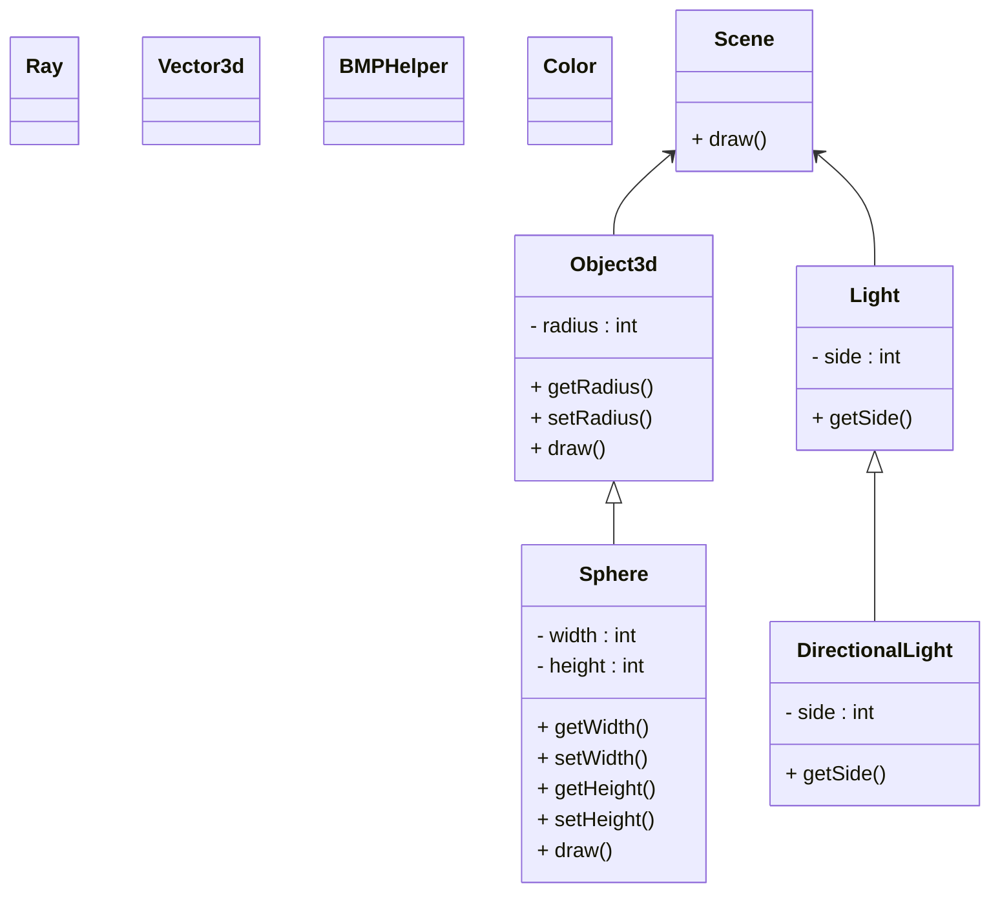
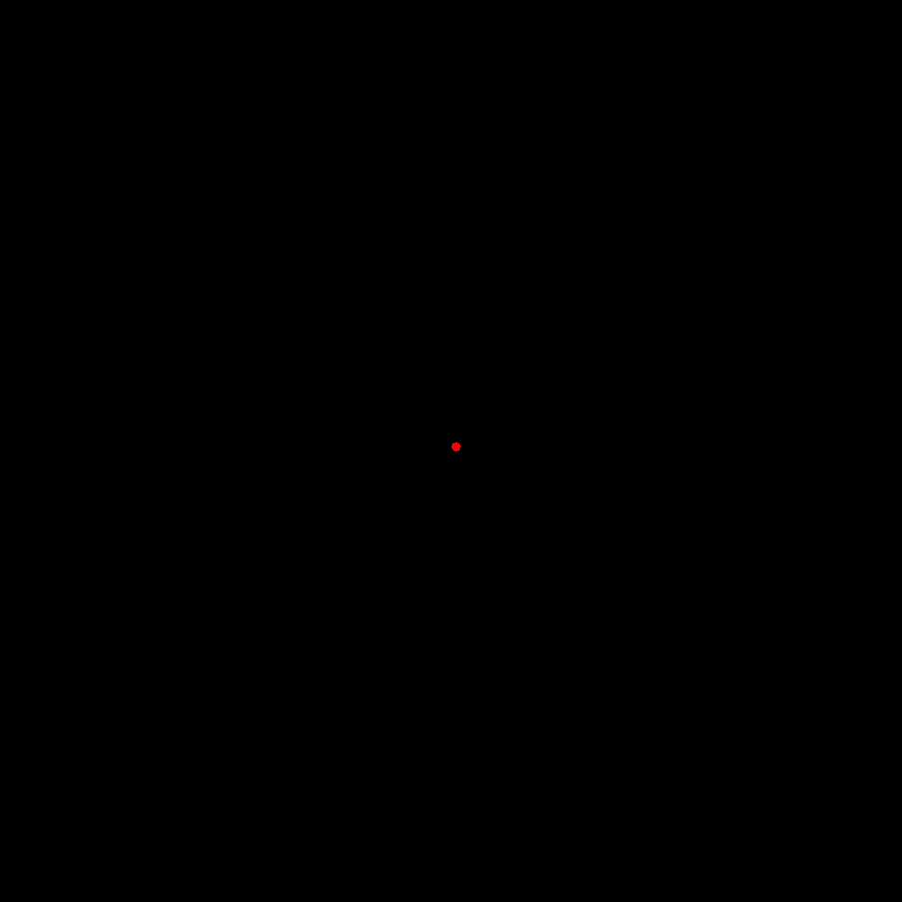

# Projet de Ray Tracing - Création d'une sphère

Projet réalisé dans le cadre du cours de sythèse d'image

Ce projet consiste à créer une sphère en utilisant le langage de programmation C++ et le principe de ray tracing. 
Le ray tracing est une technique de rendu d'images qui simule le comportement de la lumière en suivant la trajectoire 
des rayons de lumière à partir d'une source lumineuse jusqu'à leur impact sur une surface.

## Diagramme

## Résultat

